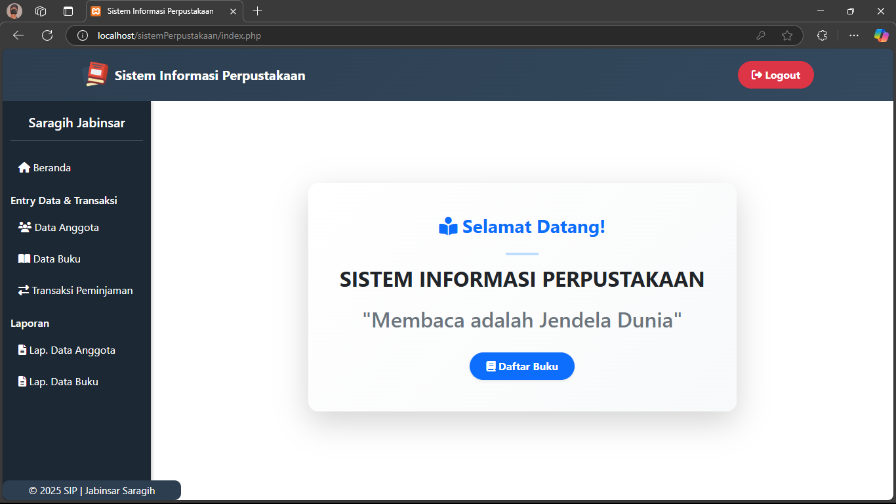

# 📚 Sistem Perpustakaan Digital

Halo! Ini adalah proyek **Website Sistem Perpustakaan Digital** yang dibangun menggunakan **PHP Native** dan **Bootstrap**. Sistem ini memudahkan proses pengelolaan buku, anggota, peminjaman buku dengan efisien dan terstruktur.

---

## 🌟 Fitur-Fitur Utama

- 📖 Manajemen Data Buku (CRUD)
- 👥 Manajemen Data Anggota
- 🔄 Peminjaman Buku
- 🔐 Login Role: Admin & Petugas
- 📊 Dashboard Ringkasan

---

## 💻 Teknologi Digunakan

| Teknologi | Deskripsi |
|----------|------------|
| PHP | Backend utama (tanpa framework, Native) |
| Bootstrap | Styling halaman agar responsive dan menarik |
| MySQL | Database penyimpanan data |
| HTML & JS | Interaksi antarmuka dan formulir |

---

## 📸 Screenshot Tampilan
**Tampilan Halaman Utama:**



---

## ❗ Note :  Ekstra terlebih dahulu File Vendor ZIP untuk menjalankan proses mencetaknya

### 1️⃣ Langkah Pertama: Download atau Clone Project

Jika dalam bentuk ZIP, ekstrak dahulu:

```bash
unzip vendor.zip
